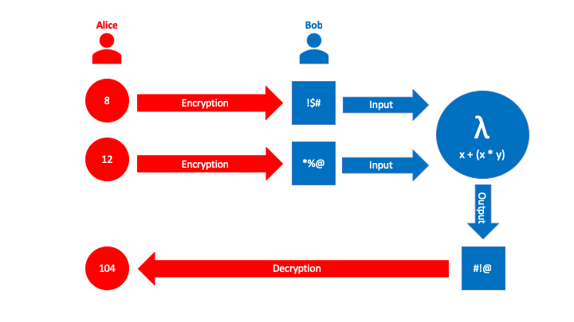

# sealsharp - C# bindings and API for SEAL

## Introduction

[SEAL](https://sealcrypto.org) is an open-source library from Microsoft Research ([code](https://github.com/Microsoft/SEAL)) for performing *homomorphic encryption* - a way of computing with encrypted data without first having to decrypt it.  

**sealsharp** is a user-friendly .NET API for SEAL. Computations are represented using C# LINQ Expressions to form an abstract syntax tree. Sealsharp then analyzes and compiles this expression tree into calls to the underlying SEAL library.

## Example



Define expression:

```csharp
Expression<Func<long, long, long>> computation = (x, y) => x + (x * y);
```

Evaluate expression:

```csharp
Ciphertext encrypted_result = evaluator.CompileAndRun (computation, relin_keys, encrypted_x, encrypted_y);
```

A full example is in the [sealsharp-example](./sealsharp-example/) directory.

## Status

The project is an early proof of concept.

At the moment we have C# bindings for only a small subset of the full SEAL API.
More functions and classes are easy to add, but it is work that has not been
done yet.

The SEAL Linq Expressions high-level API also only covers a small subset of the
possible expressions that you could write.

PRs welcome!

## Building

### Dependencies and prerequisites

Install `cmake` (OSX: `brew install cmake`) and
[Mono](https://www.mono-project.com/downloads).  You will also need a C++
compiler.

### Building

1. Make sure to initialize submodules when you first clone or when you pull changes.

       git submodule update --init --recursive

2. Run `prepare.sh` to build SEAL and install it into `./build/install`

       ./prepare.sh

   The above will also compile the SEAL examples into `./external/SEAL/bin/sealexamples`

3. Compile the `seal-c` C bindings

       ./seal-c.sh

   This will leave a shared library in `./build/install/lib/` named `libseal-c.so` or `libseal-c.dylib`

4. Build the C# bindings and example

       msbuild /t:Restore
	   msbuild

5. Run the C# example

       mono build/sealsharp-example/bin/Debug/net462/sealsharp-example.exe

The last two steps could also be done from Visual Studio by opening `sealsharp.sln` and building from the menus
